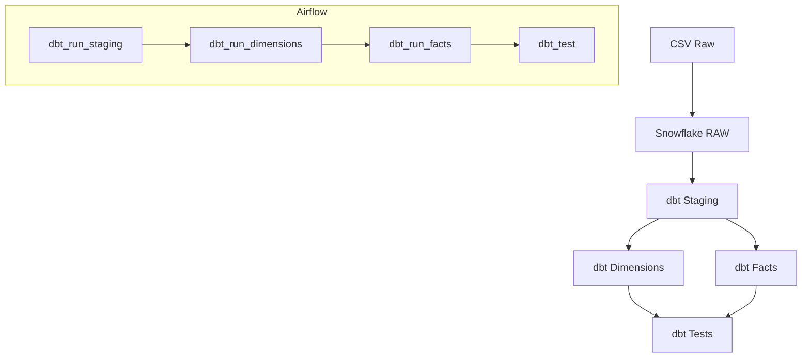

# 📦 EHR Practice Fusion Data Pipeline

Ce projet met en place un **pipeline complet** pour exploiter des données EHR (Electronic Health Records) de Practice Fusion dans Snowflake, les transformer avec **dbt**, puis orchestrer le tout avec **Apache Airflow**.

---

## 🎯 Objectifs du projet

* Mettre en place un processus automatisé d'ingestion des données EHR brutes dans Snowflake.
* Standardiser et transformer ces données via des modèles dbt (staging, dimensions, faits).
* Orchestrer l’ensemble avec Airflow pour garantir un pipeline fiable et répétable.

---

**Source des données** : [Practice Fusion EHR Dataset sur Kaggle](https://www.kaggle.com/c/pf2012)

---

## ⚙️ 1. Initialisation Snowflake

Avant toute exécution dbt ou Airflow, configurez votre instance Snowflake :

```sql
-- 1. Utiliser le rôle d'administration
USE ROLE ACCOUNTADMIN;

-- 2. Création de l'entrepôt (warehouse)
CREATE WAREHOUSE IF NOT EXISTS EHR_WH
  WITH WAREHOUSE_SIZE = 'XSMALL',
       AUTO_SUSPEND = 300,
       AUTO_RESUME = TRUE,
       INITIALLY_SUSPENDED = TRUE;

-- 3. Création de la base de données
CREATE DATABASE IF NOT EXISTS EHR_PIPELINE;

-- 4. Création des schémas
CREATE SCHEMA IF NOT EXISTS EHR_PIPELINE.RAW;
CREATE SCHEMA IF NOT EXISTS EHR_PIPELINE.STAGING;
CREATE SCHEMA IF NOT EXISTS EHR_PIPELINE.MARTS;
CREATE SCHEMA IF NOT EXISTS EHR_PIPELINE.DBT_SCHEMA;

-- 5. Création du rôle dbt_role
CREATE ROLE IF NOT EXISTS dbt_role;

-- 6. Attribution des droits au rôle dbt_role
GRANT USAGE, OPERATE ON WAREHOUSE EHR_WH TO ROLE dbt_role;
GRANT USAGE ON DATABASE EHR_PIPELINE TO ROLE dbt_role;

-- RAW layer
GRANT USAGE, CREATE TABLE, CREATE VIEW
  ON SCHEMA EHR_PIPELINE.RAW TO ROLE dbt_role;
GRANT ALL PRIVILEGES ON FUTURE TABLES, VIEWS IN SCHEMA EHR_PIPELINE.RAW TO ROLE dbt_role;

-- STAGING layer
GRANT USAGE, CREATE TABLE, CREATE VIEW
  ON SCHEMA EHR_PIPELINE.STAGING TO ROLE dbt_role;
GRANT ALL PRIVILEGES ON FUTURE TABLES, VIEWS IN SCHEMA EHR_PIPELINE.STAGING TO ROLE dbt_role;

-- MARTS layer
GRANT USAGE, CREATE TABLE, CREATE VIEW
  ON SCHEMA EHR_PIPELINE.MARTS TO ROLE dbt_role;
GRANT ALL PRIVILEGES ON FUTURE TABLES, VIEWS IN SCHEMA EHR_PIPELINE.MARTS TO ROLE dbt_role;

-- DBT_SCHEMA (optionnel)
GRANT USAGE, CREATE TABLE, CREATE VIEW
  ON SCHEMA EHR_PIPELINE.DBT_SCHEMA TO ROLE dbt_role;
GRANT ALL PRIVILEGES ON FUTURE TABLES, VIEWS IN SCHEMA EHR_PIPELINE.DBT_SCHEMA TO ROLE dbt_role;

-- 7. Attribution du rôle à l'utilisateur
-- Utiliser un placeholder pour l'utilisateur
GRANT ROLE dbt_role TO USER "<YOUR_USER>";
```

> **NB** : Remplacez `<YOUR_USER>` par votre identifiant Snowflake. Ne committez jamais d’identifiants en clair.

---

## 🚀 2. Ingestion des données brutes (RAW)

1. **Création du stage CSV**

   Dans Snowflake (schéma **RAW**), créez un stage pour lire les CSV :

   ```sql
   CREATE OR REPLACE STAGE ehr_stage
     FILE_FORMAT = (
       TYPE = CSV,
       FIELD_DELIMITER = ',',
       FIELD_OPTIONALLY_ENCLOSED_BY = '"',
       SKIP_HEADER = 1,
       TRIM_SPACE = TRUE,
       NULL_IF = ('NULL','null','','N/A'),
       EMPTY_FIELD_AS_NULL = TRUE,
       ERROR_ON_COLUMN_COUNT_MISMATCH = FALSE
     );
   ```

2. **Upload des fichiers**

   Depuis votre machine :

   ```bash
   snowsql -c ehr_pipeline -q "PUT file://./data/*.csv @ehr_stage AUTO_COMPRESS=FALSE;"
   ```

3. **Chargement en base**

   Exécutez le script `ingestion/ingest_raw_data.sql` pour copier chaque CSV dans sa table RAW :

   ```sql
   COPY INTO RAW.ALLERGY            FROM @ehr_stage/training_SyncAllergy.csv ON_ERROR=CONTINUE;
   COPY INTO RAW.DIAGNOSIS          FROM @ehr_stage/training_SyncDiagnosis.csv ON_ERROR=CONTINUE;
   COPY INTO RAW.PATIENT            FROM @ehr_stage/training_SyncPatient.csv ON_ERROR=CONTINUE;
   -- ... autres tables
   COPY INTO RAW.TRANSCRIPTMEDICATION FROM @ehr_stage/training_SyncTranscriptMedication.csv ON_ERROR=CONTINUE;
   ```

4. **Vérification**

   Intégrez un bloc SQL de `SELECT COUNT(*)` pour valider le nombre de lignes chargées par table.

---

## 🧱 3. Modélisation dbt en trois couches

### 3.1 Couche **STAGING** (schéma `STAGING`)

* **Objectif** : Normaliser et typer les données brutes.
* **Modèles** : `models/staging/stg_*.sql` (materialized as `view`).
* **Documentation & tests** : `models/staging/schema.yml`.

### 3.2 Couche **MARTS** – Dimensions (schéma `MARTS`)

* **Objectif** : Créer les référentiels dé-duppliqués (`dim_*`).
* **Modèles** : `models/marts/dim/dim_*.sql` (materialized as `table`).
* **Documentation & tests** : `models/marts/schema.yml`.

### 3.3 Couche **MARTS** – Faits (schéma `MARTS`)

* **Objectif** : Agréger et historiser les indicateurs (`fct_*`).
* **Modèles** : `models/marts/fact/fct_*.sql` (materialized as `table`).
* **Documentation & tests** : idem.

---

## ⚙️ 4. Configuration dbt

### dbt\_project.yml

Définissez les schémas et matérialisations :

```yaml
models:
  ehr_pipeline:
    staging:
      +schema: STAGING
      +materialized: view

    marts:
      +schema: MARTS
      +materialized: table
      dim:
        +schema: MARTS
      fact:
        +schema: MARTS
```

### profiles.yml

Utilisez des variables d’environnement :

```yaml
ehr_pipeline:
  target: dev
  outputs:
    dev:
      type: snowflake
      account: lw87791.ca-central-1.aws
      user: "{{ env_var('SNOWFLAKE_USER') }}"
      password: "{{ env_var('SNOWFLAKE_PASSWORD') }}"
      role: dbt_role
      database: EHR_PIPELINE
      warehouse: ehr_wh
      schema: STAGING
      threads: 4
```

> **NB** : Ne commettez jamais vos credentials. Utilisez `.env` ou les secrets CI/CD.

---

## 🛠️ 5. Orchestration Airflow

L’orchestration est assurée par **Apache Airflow** avec l’opérateur Cosmos :

* **dbt\_run\_staging** : exécute les modèles de nettoyage (`models/staging`).
* **dbt\_run\_dimensions** : exécute les modèles de dimensions (`models/marts/dim`).
* **dbt\_run\_facts** : exécute les modèles de faits (`models/marts/fact`).
* **dbt\_test** : lance les tests dbt sur tous les modèles déployés.

La connexion à Snowflake utilise un **Connection ID** (`conn_ehr_pipeline`) configuré dans Airflow, qui pointe vers vos secrets (login, mot de passe, account, warehouse, role).

---

## 📊 6. Flux de données et dépendances



---

> **Auteur :** Khalifa Ababacar Seck
> **Date :** Août 2025
> **Projet :** EHR Practice Fusion Data Pipeline
