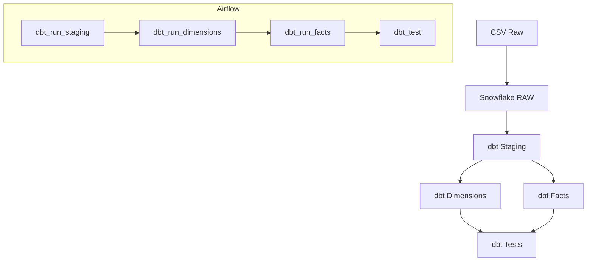

# 📦 EHR Practice Fusion Data Pipeline

Ce projet met en place un **pipeline complet** pour exploiter des données EHR (Electronic Health Records) de Practice Fusion dans Snowflake, les transformer avec **dbt**, puis orchestrer le tout avec **Airflow**.

---

## 🎯 Objectifs du projet

* Mettre en place un processus automatisé d'ingestion des données EHR brutes dans Snowflake.
* Standardiser et transformer ces données via des modèles dbt (staging, dimensions, faits).
* Orchestrer l’ensemble avec Apache Airflow pour garantir un pipeline fiable et répétable.

---

**Source des données** : [Practice Fusion EHR Dataset sur Kaggle](https://www.kaggle.com/c/pf2012)

---

## 🚀 1. Ingestion des données brutes (RAW)

1. **Création du stage CSV**

   * Dans Snowflake (schéma **RAW**) :

     ```sql
     CREATE OR REPLACE STAGE ehr_stage
       FILE_FORMAT = (
         TYPE = CSV,
         FIELD_DELIMITER = ',',
         FIELD_OPTIONALLY_ENCLOSED_BY = '"',
         SKIP_HEADER = 1,
         TRIM_SPACE = TRUE,
         NULL_IF = ('NULL','null','','N/A'),
         EMPTY_FIELD_AS_NULL = TRUE,
         ERROR_ON_COLUMN_COUNT_MISMATCH = FALSE
       );
     ```

2. **Upload des fichiers**

   ```bash
   snowsql -c ehr_pipeline -q "PUT file://./data/*.csv @ehr_stage AUTO_COMPRESS=FALSE;"
   ```

3. **Chargement en base**

   * Exécuter : `ingestion/ingest_raw_data.sql` contenant :

     ```sql
     COPY INTO RAW.ALLERGY            FROM @ehr_stage/training_SyncAllergy.csv ON_ERROR=CONTINUE;
     COPY INTO RAW.DIAGNOSIS          FROM @ehr_stage/training_SyncDiagnosis.csv ON_ERROR=CONTINUE;
     COPY INTO RAW.PATIENT            FROM @ehr_stage/training_SyncPatient.csv ON_ERROR=CONTINUE;
     -- ... autres tables
     COPY INTO RAW.TRANSCRIPTMEDICATION FROM @ehr_stage/training_SyncTranscriptMedication.csv ON_ERROR=CONTINUE;
     ```

4. **Vérification**

   * Un bloc SQL de `SELECT COUNT(*)` pour chaque table valide le chargement.

---

## 🧱 2. Modélisation dbt en trois couches

### 🎯 2.1 Couche **STAGING** (schéma `STAGING`)

* **Objectif** : Normaliser et typer les données brutes.
* **Modèles** : `models/staging/stg_*.sql` (materialized as `view`).
* **Documentation & tests** : `models/staging/schema.yml`.

### 🎯 2.2 Couche **MARTS** – Dimensions (schéma `MARTS`)

* **Objectif** : Créer les référentiels dé-duppliqués (`dim_*`).
* **Modèles** : `models/marts/dim/dim_*.sql` (materialized as `table`).
* **Documentation & tests** : `models/marts/schema.yml`.

### 🎯 2.3 Couche **MARTS** – Faits (schéma `MARTS`)

* **Objectif** : Agréger et historiser les indicateurs (`fct_*`).
* **Modèles** : `models/marts/fact/fct_*.sql` (materialized as `table`).
* **Documentation & tests** : idem.

---

## ⚙️ 3. Configuration dbt

### 3.1 dbt\_project.yml

```yaml
models:
  ehr_pipeline:
    staging:
      +schema: STAGING
      +materialized: view

    marts:
      +schema: MARTS
      +materialized: table
      dim:
        +schema: MARTS
      fact:
        +schema: MARTS
```

### 3.2 profiles.yml

```yaml
ehr_pipeline:
  target: dev
  outputs:
    dev:
      type: snowflake
      account: lw87791.ca-central-1.aws
      user: "{{ env_var('SNOWFLAKE_USER') }}"
      password: "{{ env_var('SNOWFLAKE_PASSWORD') }}"
      role: dbt_role
      database: EHR_PIPELINE
      warehouse: ehr_wh
      schema: STAGING
      threads: 4
```

> **NB** : Ne pas committer de credentials ; utilisez un fichier `.env` ou les secrets CI/CD.

---

## 🛠️ 4. Orchestration Airflow

L’orchestration est assurée par **Apache Airflow** avec l’opérateur Cosmos pour :

* **dbt\_run\_staging** : exécuter les modèles de nettoyage (`models/staging`).
* **dbt\_run\_dimensions** : exécuter les modèles de dimensions (`models/marts/dim`).
* **dbt\_run\_facts** : exécuter les modèles de faits (`models/marts/fact`).
* **dbt\_test** : lancer les tests dbt sur les modèles générés.

La connexion à Snowflake utilise un **Connection ID** configuré dans Airflow, qui pointe vers les variables d’environnement et secrets (login, mot de passe, account, warehouse, role).

## 📊 5. Flux de données et dépendances Flux de données et dépendances



---
